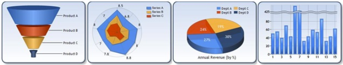

# Master -> main rename

The `master` branch has recently been renamed to `main` in this repo. 

- If you are creating a new clone or fork, no additional work is needed on your end.
- If you have an existing clone, you might see the following error when trying to perform git operatins against origin:

      Your configuration specifies to merge with the ref 'refs/heads/master' from the remote, but no such ref was fetched.

- To fix this, update your local clones with the following steps:

      git checkout master
      git branch -m master main
      git fetch
      git branch --unset-upstream
      git branch -u origin/main
      git symbolic-ref refs/remotes/origin/HEAD refs/remotes/origin/main

- If you have an existing fork, additional work might be required as well. This work is currently TBD.

# Data Visualization

This repository contains partial source code of the `System.Windows.Forms.DataVisualization` namespace that provides charting for WinForms. We ported and open sourced those components to enable charting features for WinForms applications that are developed on .NET Core 3.

**This repo is read-only**. We consider the `System.Windows.Forms.DataVisualization` deprecated and we only provide it to ease porting to .NET Core 3. We're not going to innovate in this component and subsequently will not accept any PRs

## Getting started with Chart Controls

The best way to learn about Chart Controls is by looking at the [sample solution](https://github.com/dotnet/winforms-datavisualization/tree/master/sample) where via interactive experience with the app you can learn about every chart type and every major feature. While modifying the control parameters and instantly seeing how that affects the look of the control, you can also get the generated C# or Visual Basic code to use in your apps.

There is also a [.NET Framework version](https://code.msdn.microsoft.com/Windows-Forms-Samples-26bf2a53) of this sample available on Microsoft samples portal.

Pre-release version of this package is available from [NuGet Gallery](https://www.nuget.org/packages/System.Windows.Forms.DataVisualization)
